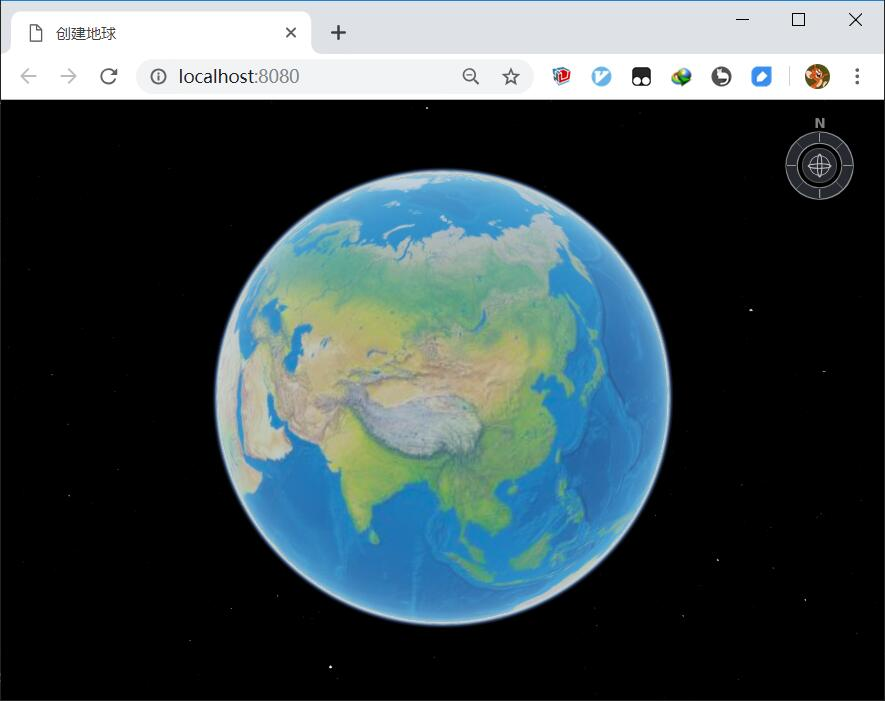

# earthsdk-vue-cli-app

## 简介

通过vue-cli创建项目，然后再基于EarthSDK创建地球。
如果是大型项目，可以参考这种方式来构建程序。



## Project setup
```
npm install
```

### Compiles and hot-reloads for development
```
npm run serve
```

### Compiles and minifies for production
```
npm run build
```

### Run your tests
```
npm run test
```

### Lints and fixes files
```
npm run lint
```

### Customize configuration
See [Configuration Reference](https://cli.vuejs.org/config/).

## 在vue-cli的基础上加入对EarthSDK的支持的方法说明

1. 加入必须的包
```
npm install copy-webpack-plugin
npm install earthsdk
```

2. 创建vue.config.js
```javascript
// vue.config.js
const CopyWebpackPlugin = require('copy-webpack-plugin');

module.exports = {
  configureWebpack: config => {
    const cwp = new CopyWebpackPlugin([
      {
        from: './node_modules/earthsdk/dist/XbsjCesium',
        to: 'js/earthsdk/XbsjCesium',
        toType: 'dir'
      },
      {
        from: './node_modules/earthsdk/dist/XbsjEarth',
        to: 'js/earthsdk/XbsjEarth',
        toType: 'dir'
      },
    ]);
    config.plugins.push(cwp);
  }
}
```

3. 创建地球组件 EarthComp.vue
```html
<template>
  <div style="width: 100%; height: 100%">
    <div ref="earthContainer" style="width: 100%; height: 100%"></div>
    <div style="position: absolute; left: 18px; top: 18px">
      <button>{{ message }}</button>
    </div>
  </div>
</template>

<script>
// 1 创建Earth的vue组件
var EarthComp = {
  data() {
    return {
      message: "页面加载于 " + new Date().toLocaleString(),
      _earth: undefined, // 注意：Earth和Cesium的相关变量放在vue中，必须使用下划线作为前缀！
      _bgImagery: undefined
    };
  },
  // 1.1 资源创建
  mounted() {
    // 1.1.1 创建地球
    var earth = new XE.Earth(this.$refs.earthContainer);

    // 1.1.2 添加默认地球影像
    earth.sceneTree.root = {
      children: [
        {
          czmObject: {
            name: "默认离线影像",
            xbsjType: "Imagery",
            xbsjImageryProvider: {
              createTileMapServiceImageryProvider: {
                url: XE.HTML.cesiumDir + "Assets/Textures/NaturalEarthII",
                fileExtension: "jpg"
              },
              type: "createTileMapServiceImageryProvider"
            }
          }
        }
      ]
    };

    this._earth = earth;

    // 仅为调试方便用
    window.earth = earth;
  },
  // 1.2 资源销毁
  beforeDestroy() {
    // vue程序销毁时，需要清理相关资源
    this._earth = this._earth && this._earth.destroy();
  }
};

export default EarthComp;
</script>
```

4. 修改main.js，

需要等待earthsdk载入以后(XE.ready())，再创建vue的示例(new Vue(...))，代码如下：

```
// 之前的代码注释掉
// new Vue({
//   render: h => h(App),
// }).$mount('#app')

// 修改后的代码
function startup() {
  new Vue({
    render: h => h(App),
  }).$mount('#app')
}

// 1 XE.ready()会加载Cesium.js等其他资源，注意ready()返回一个Promise对象。
XE.ready().then(startup);    
```

5. 再改改index.html文件中的css样式等
